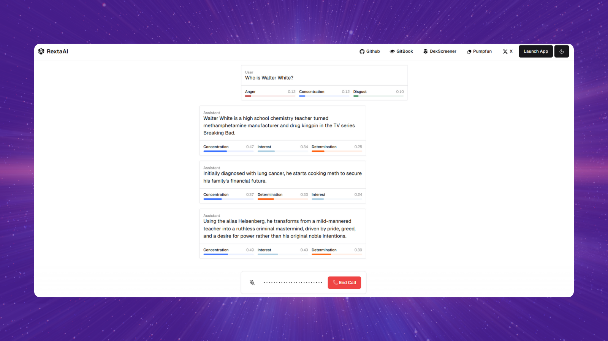

  
  <h1>EVI Next.js App Router Example</h1>

## Links

- [X](https://x.com/RextaAI)
- [Pumpfun](https://pump.fun/board)
- [DexScreener](https://dexscreener.com/)
- [Gitbook](https://rextaai.gitbook.io/rextaai)
- [Github](https://github.com/x19ai/RextaApp)
- CA: So11111111111111111111111111111111111111112

## Overview

This project features a sample implementation of Hume's [Empathic Voice Interface](https://hume.docs.buildwithfern.com/docs/empathic-voice-interface-evi/overview) using Hume's React SDK. Here, we have a simple EVI that uses the Next.js App Router.

## Project deployment

Click the button below to deploy this example project with Vercel:

Below are the steps to completing deployment:

1. Create a Git Repository for your project.
2. Provide the required environment variables. To get your API key and Client Secret key, log into the portal and visit the [API keys page](https://beta.hume.ai/settings/keys).

## Support

If you have questions, require assistance, or wish to engage in discussions pertaining to this starter template, [please reach out to us on X](https://x.com/RextaAI).